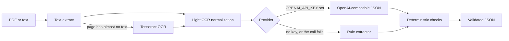

# Change-order extraction

Construction change orders arrive as G701-style forms, subcontractor emails, one-page PCOs, and phone-photo scans. The same fact (the total, the subtotal, the schedule) is printed in different places, sometimes inconsistently, sometimes only in a margin note. This package reads a PDF or plain text and returns JSON validated by a Pydantic schema. Every field has a confidence score and a source quote. Fields the pipeline does not trust are marked `needs_review` instead of being quietly filled in.

It runs with no API key. If `OPENAI_API_KEY` is set, an OpenAI-compatible model proposes the fields and the same deterministic checks still run afterward.

## Architecture



| Piece | Role |
| --- | --- |
| `pdf_text` | pypdf for text PDFs. A page with fewer than 40 letters or digits is treated as a scan and OCR'd if `tesseract` is on `PATH`. |
| `textutil` | Money, dates, and a small OCR repair: `0` glued to letters becomes `O`; a `1` glued to letters is rewritten only when exactly one word in a built-in list matches. A real digit error is left alone. |
| `rules` / `providers` | The rule extractor is the default. `OpenAICompatibleExtractor` posts to `OPENAI_BASE_URL` (default `https://api.openai.com/v1`) with temperature 0. A failed call falls back to the rules. |
| `checks` | Grounds values in the source, checks line and total math, and sets confidence, `needs_review`, and document-level flags. It does not replace a printed number with a recomputed one. |
| `evaluate` | Scores the nine labeled text fixtures. |

`line_subtotal` means the sum of the line items before markup, tax, and bond. On a form that prints both "Net" and "Subtotal before tax", the value closest to the line-item sum is the one kept.

## Confidence

Each field is `{value, confidence, needs_review, evidence}`. Confidence stays in `[0, 1]` and is capped at **0.93**. Anything present with confidence under **0.65** is `needs_review`. Missing required fields (project name, change-order number, contractor, description, date, total) are flagged too. An optional field that is simply absent, such as owner on a short PCO, is null with `needs_review` false.

Starting confidence comes from the provider: about 0.86–0.90 for a labeled rule match, 0.60–0.70 for a prose guess, and at most 0.80 from the model. Checks then adjust it:

1. If the value is not in the source, multiply by 0.3 and force review. If it is, add 0.03. A zero amount is accepted when the text says "tax exempt" or "no markup".
2. When quantity, unit price, and amount are all present, add 0.04 if `qty * unit price` is within $0.05 of the amount; otherwise multiply those three by 0.55.
3. If the line amounts do not sum to `line_subtotal`, multiply the subtotal by 0.5 and the total by 0.65.
4. If `line_subtotal + markup + tax + other_fees` is not the total (missing optional pieces count as zero), multiply the total by 0.5.
5. If a printed markup or tax percent does not reproduce the printed amount, multiply that pair by 0.6. Tax may be on the line subtotal or on the subtotal plus markup and fees.
6. If the text mentions more than one duration in days, multiply schedule confidence by 0.55. The labeled schedule value is kept.
7. Document confidence is a weighted mean. The change-order number and the total weigh 1.5; a missing required field contributes 0. A math failure multiplies the document score by 0.85. A margin note or a schedule conflict multiplies it by 0.9 when the arithmetic still ties.

An unincorporated dollar amount, such as a margin note that says it is not in the total, is returned under `unincorporated_notes` and does not change the total.

## Run it

Python 3.11 or newer. Scanned PDFs also need the Tesseract binary (`sudo apt-get install tesseract-ocr`). Text files and text PDFs do not.

```bash
python -m venv .venv
source .venv/bin/activate
pip install -e ".[dev]"

pytest
change-order extract samples/co_01_aia_clean.txt
change-order extract samples/pdf/co_scanned_cedar.pdf -o scan.json
change-order eval

uvicorn change_order_extract.api:app --reload
# POST /extract {"text": "..."}   or   POST /extract/file
```

`uv` works the same way: `uv venv && uv pip install -e ".[dev]"`.

Nothing is sent off the machine unless `OPENAI_API_KEY` is set and the provider is `auto` or `openai`.

| Variable | Purpose |
| --- | --- |
| `OPENAI_API_KEY` | Switches `auto` from the rules to the API. |
| `OPENAI_BASE_URL` | OpenAI-compatible base URL. Default `https://api.openai.com/v1`. |
| `CHANGE_ORDER_MODEL` | Default `gpt-4o-mini`. |
| `CHANGE_ORDER_PROVIDER` | `auto`, `rules`, or `openai`. |

`change-order extract --provider rules` forces the local path even when a key is present.

## What the JSON looks like

This is the real result for `samples/co_03_inconsistent_total.txt`, cut down to the fields that show the check. The line items sum to $2,564.00. The form says $2,800.00. Both printed figures are returned, and both are flagged:

```json
{
  "change_order_number": {
    "value": "COR-19",
    "confidence": 0.93,
    "needs_review": false,
    "evidence": "CO Number: COR-19"
  },
  "line_subtotal": {
    "value": "2800.00",
    "confidence": 0.29,
    "needs_review": true,
    "evidence": "Subtotal: $2,800.00"
  },
  "total": {
    "value": "2800.00",
    "confidence": 0.605,
    "needs_review": true,
    "evidence": "Total: $2,800.00"
  },
  "document_confidence": 0.714,
  "review_flags": [
    "math: line items sum to 2564.00 but line_subtotal is 2800.00"
  ],
  "method": "rules"
}
```

## Evaluation

`change-order eval` scores nine text fixtures in `samples/` against `samples/expected/`. Gold is what a careful reader would copy, including a total that does not match the lines. A match on money is within one cent. Names and descriptions match on normalized text or token F1. Null on both sides is ignored. A value where the gold is null is a false positive.

These rules were written against this set. The 1.000 below is the score on that set, not a held-out or production accuracy. The useful measurements are which correct readings were still flagged, and how low the document score goes when the page disagrees with itself.

Measured with the rule provider, no API key:

| | |
| --- | --- |
| Documents | 9 |
| Labeled field accuracy | **1.000** (264/264) |
| False positives | 0 |
| High-confidence accuracy (labeled, confidence ≥ 0.80) | **1.000** (244/244) |
| Mean confidence when correct | 0.892 |
| Mean confidence when incorrect | n/a (no incorrect fields) |
| ECE (4 bins; every bin had accuracy 1.0) | **0.108** |
| Value errors flagged for review | 0/0 |
| Correct values still flagged | 9 |

ECE is under-confidence: correct fields sit near 0.89 rather than 1.0. That is intentional. The cap is 0.93.

Document confidence on the same run:

| Fixture | What is awkward about it | Labeled | Document confidence |
| --- | --- | --- | --- |
| `co_01_aia_clean` | G701-style form, markup and tax | 32/32 | 0.921 |
| `co_02_email_quote` | Email, dotted leaders, no date or owner | 33/33 | 0.833 |
| `co_03_inconsistent_total` | Lines sum to 2564; form says 2800 | 34/34 | 0.714 |
| `co_04_missing_fields` | No project, date, or owner | 22/22 | 0.736 |
| `co_05_ocr_noise` | `0`/`1` confusions; total printed as 4008.50, math says 4009.50 | 31/31 | 0.745 |
| `co_06_margin_note` | "$450 not in total", and both 6 and 7 days | 31/31 | 0.813 |
| `co_07_markup_bond_tax` | Net vs subtotal-before-tax, bond, tax on the loaded amount | 33/33 | 0.918 |
| `co_08_credit` | Negative line; 10% markup is not 10% of the net credit | 26/26 | 0.762 |
| `co_09_prose_items` | Line items in a sentence; tax stated as 7% with no tax dollars | 22/22 | 0.695 |

The nine flagged-but-correct fields are the inconsistent subtotal and total, the OCR'd total of 4008.50, the 6-day schedule that conflicts with a "7 days??" note, the credit's markup and markup percent, the prose total that cannot tie without inventing the tax, and the prose crane-day description and amount (both 0.63).

The scanned fixture is not in those 264 fields, because Tesseract's exact text depends on the binary. On Tesseract 5.3.4 the image-only PDF `samples/pdf/co_scanned_cedar.pdf` was read with `ocr_used: true`. Project, CO 6, date 2026-08-08, and the stated total 995.00 came through. The labor row was read as `4 HR _ 110.00 440.00`. The underscore kept it from parsing as a line item, so the check flagged line items of 555.00 against a subtotal of 995.00 and parked 110.00 and 440.00 as an unincorporated note. Document confidence on that run was 0.703. The test locks the stable fields (OCR used, project, number, date, stated total), not the stray underscore.

Regenerate the PDFs with `python scripts/build_fixtures.py`.

## Failure modes

- **OCR that is still a digit.** `4008.50` vs `4009.50` is not repaired. A stray `_` or a broken glyph can drop a whole row. The total then disagrees with the lines and is flagged, which is the desired failure, but the missing row is not reconstructed.
- **Rows that wrap.** The parser is line-oriented. A description continued on the next line is not stitched back, and a row whose amount falls on the following line is dropped.
- **Multi-page tables.** Page text is concatenated. A row cut in half by a page break is not repaired. The text PDF of the clean sample is two pages only because the header and the lines happen to stay intact.
- **Which "subtotal".** Some forms use that word for the line-item net and again for the amount after markup, bond, and before tax. The closest figure to the line sum wins. A third column of "previous contract sum" is out of scope.
- **Ambiguous amounts.** A sentence can hold a unit price, an extension, and a rounded total. The prose patterns are narrow (`620 square feet at $3.25`, `a crane day at $1,400`). Other phrasings return nothing.
- **Handwriting that never becomes text.** A margin note is caught only when it is in the text or the OCR output. A photo of a signature is not a signature status. "Pending" vs "approved" is a keyword decision and will miss a stamp the OCR skipped.
- **Hallucinated model output.** Values that are not in the source are cut to about 0.3 confidence. A one-character id such as "4" is weakly grounded, because that digit often appears elsewhere on the page.
- **Currency and units.** `$` maps to USD. There is no euro, and no unit outside a short list (LF, SF, EA, LS, HR, SY, LB, and a few others). "square feet" is normalized to SF; an unknown unit is left unmatched.
- **Percent with no dollars.** Tax of 7% does not become $239.05. The total then fails the tie-out and is flagged. That is better than inventing the tax, and it is still a miss if a downstream system expected the dollars.
- **Markup that is not "percent of subtotal".** The credit sample's 10% applies to the add only. The check flags it. It does not try to guess the base.

## What I would do next in production

Keep this shape: a schema, a quote for every value, and checks that can veto a model. Around it:

- A review UI that shows the quote in the PDF and writes the corrected JSON back. That log is the calibration set. Isotonic regression on those decisions would replace the hand-set 0.65 and 0.93.
- A held-out corpus across more than one general contractor and form family, including real scans and real handwriting. This repo's 264/264 number should not be cited outside these fixtures.
- A table model for schedules of values that span pages, with row stitching and continuation headers.
- Routers for a few known layouts (G701, a subcontractor quote, a PCO email) in front of the generic extractor.
- Character offsets for evidence, not just a quote, so grounding survives a repeated number.
- Per-tenant storage of the raw text, the model name, and the checker version. Do not send owner documents to a third-party model without a contract; the rules path is the offline default for a reason.
- A queue and an idempotency key. Money fields with `needs_review` do not post into the job cost system until a person clears them.

## Layout

```
src/change_order_extract/   schema, pipeline, rules, checks, API, CLI
samples/                    nine text fixtures, expected JSON, two PDFs
tests/                      pytest
.github/workflows/ci.yml    ruff, pytest, and eval on Python 3.11
```

CI installs Tesseract, then runs `ruff`, `pytest`, and `change-order eval`.
